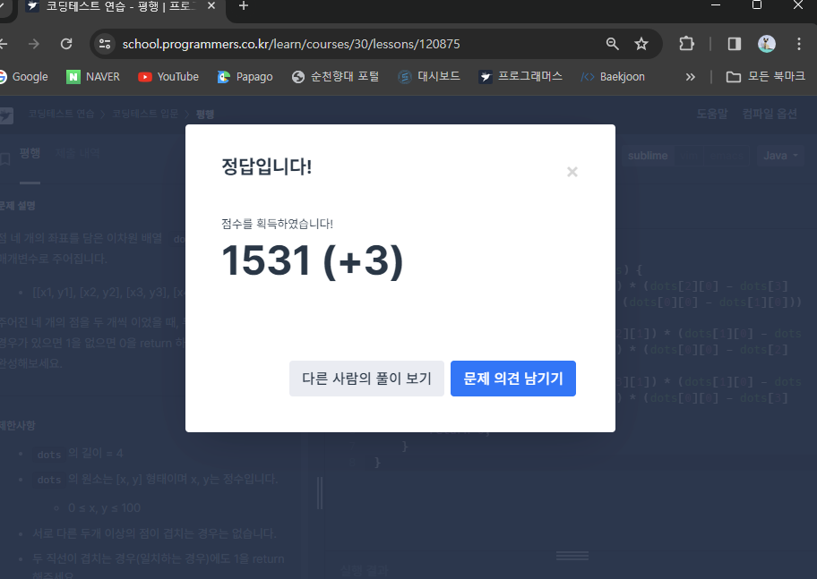

# Contents

## Algorithm

참고: <!-- https://myeongmy.tistory.com/55 -->

### main

* Simulation
* Data Structures
* Graph Theory (BFS(queue) & DFS(stack))
* Bruteforcing

### sub

* Dynamic Programming
* Greedy
* String
* Binary Search

## schedule

* 1 week
  * 0108 / BAEKJOON / 🥈 IV 9012  ***String***
  * 0112 / BAEKJOON / 🥈 IV 10816  ***Data Structures***

* 2 week
  * 0114 / BAEKJOON / 🥈III 1966  ***Simulation***
  * 0115 / BAEKJOON / 🥈 IV 2839  ***Greedy***
  * 0116 / PROGRAMMERS / 가위 바위 보
  * 0117 / PROGRAMMERS / 제곱수 판별하기
  * 0118 / PROGRAMMERS / 문자열을 정수로 변환하기
  * 0119 / PROGRAMMERS / n개 간격의 원소들

* 3 week
  * 0121 / PROGRAMMERS / 9로 나눈 나머지
  * 0122 / PROGRAMMERS / 짝수는 싫어요
  * 0124 / BAEKJOON / 🥈 II 1260  ***Graph Theory***
  * 0126 / BAEKJOON / 🥈 IV 1065  ***Bruteforcing***

* 4 week
  * 0128 / PROGRAMMERS / 원소들의 곱과 합
  * 0129 / PROGRAMMERS / 합성수 찾기
  * 0131 / BAEKJOON / 🥈 IV 2839  ***DP***
  * 0202 / BAEKJOON / 🥈 IV 1920  ***Binary Search***

* 5 week
  * 0204 / PROGRAMMERS / 꼬리 문자열
  * 0205 / PROGRAMMERS / 소문자로 바꾸기
  * 0207 / BAEKJOON / 🥈 IV 1244  ***Simulation***
  * 0209 / BAEKJOON / 🥈 IV 9012  ***Data Structures***

* 6 week
  * 0211 / PROGRAMMERS / 종이 자르기
  * 0212 / PROGRAMMERS / 평행

    

    level 0에서 3점이다...! (신기)(방기)

  * 0214 / BAEKJOON / 🥈 I 2178  ***Graph Theory***
  * 0216 / BAEKJOON /🥈 IV 1018  ***Bruteforcing***

* 7 week
  * 0220 / PROGRAMMERS / 특별한 이차원 배열 2
  * 0221 / BAEKJOON / 🥇 V 14503 ***Simulation***
  * 0222 / PROGRAMMERS / 소인수분해
  * 0223 / BAEKJOON / 🥈 IV 10828 ***Data Structures***

* 8 week
  * 0227 / PROGRAMMERS / n의 배수
  * 0228 / BEAKJOON / 🥈 III 2606 ***Graph Theory***
  * 0229 / PROGRAMMERS / 배열의 유사도

* 9 week
  * 0305 / BAEKJOON / 🥇 IV 9663 ***Bruteforcing***
